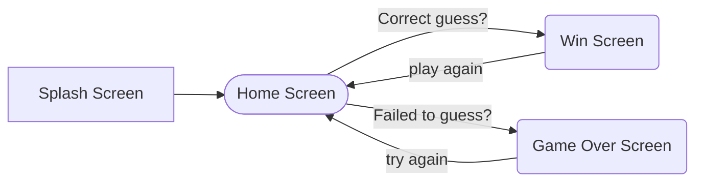

# Wordly - A Category-Based Wordle Game


>  "**A developer is one who builds what they desire to see in reality.**"


While playing Wordle, I realized how challenging it is to guess a random word without any hints or categories. With billions of words in existence, it's almost impossible to know them all. That's when I identified a problem — Wordle should allow users to pick a category to make guessing more strategic and enjoyable. So, I built Wordly — a vibrant, playful Wordle game where users can guess words by choosing categories like Finance, Plants, Sports, and more. This enhances the guessing experience and gives players a fairer chance to win.

## App Description

Wordly is a colorful and engaging word-guessing game that lets users choose a word category before playing. This feature helps users narrow their guesses, improving the gaming experience.

**Categories Available:**

 - Finance
 - Plants
 - Sports
 - Food
 - Places
 - Social Media
 - Technology
 - Bollywood
 - Entertainment

**Screens in the App:**

 - Splash Screen

 - Home Screen (Choose category, start game)

 - Win Screen (If correct guess)

 - Game Over Screen (If all attempts fail)

**Additional Features:**

 - Users can view their score and streak.

 - After each game, users can explore the "Did You Know?" section to
   learn the word's meaning, synonyms, examples, and part of speech.

- The app boasts a playful and colorful UI with animations that enhance the user experience.

## Purpose & Goal

Wordly was created to solve the frustrating problem of random word guessing by introducing category-based gameplay, making the experience fairer and more engaging for players.

## Key Features

**Core Features:**

 - 5 Attempts to Guess a 5-Letter Word
   
 - Color Indicators for Character Accuracy

 - Green = Correct letter in the correct position.

 - Yellow = Correct letter but wrong position.

 - Grey = Letter not in the word.

 - Score and Streak Tracking

 - Win or Game Over Screens with a "Play Again" option.

**Unique Features:**

 - **"Did You Know?" Section**: Offers word-related information (meaning,
   synonyms, part of speech, and examples).

 - **Category Selection**: Allows users to select a word category for
   focused guessing.

## Tech Stack

``` 
Flutter (Framework)

Dart (Language)

SharedPreferences (For score persistence)

Provider (State management)

Firebase (For future analytics, crashlytics, or cloud features)
```

## Packages Used:

``` provider: ^6.1.2
http: ^1.3.0
flutter_svg: ^2.0.17
flutter_animate: ^4.5.2
lottie: ^3.3.1
showcaseview: ^4.0.1
flutter_launcher_icons: ^0.14.3
shared_preferences: ^2.2.2
```

## App Flow (User Journey)




- Splash Screen

- Home Screen (Choose a category and start playing)

- Game Screen

  - Guess the word in 5 tries.

  - Correct guess? ➔ Win Screen

  - Failed to guess? ➔ Game Over Screen

- "Did You Know?" Section (Word details)

- Play Again (Resets board but retains score)

## Code Highlights

**Splash Screen:**   Animated splash with logo and "Let's Play" button.

**Home Screen:**

- Displays category options.

- Disables category change once the game starts.

- Shows a snackbar if the user attempts to play without selecting a category.

 **Game Logic:**

 - Checks word validity via Dictionary API.

 - Validates character placement with color indicators.

**Win/Game Over Screen:**

 - Displays the correct word, score, and streak.

 - Includes a "Did You Know?" section for word details.

## Installation Guide (Coming Soon)

Step-by-step instructions will be provided once development is complete.

## API Documentation

Uses Dictionary API for word validation and fetching word details:

    https://api.dictionaryapi.dev/api/v2/entries/en/{word}

## Future Improvements

- Expanding the list of categories for greater variety.

- Adding leaderboard and achievement features for enhanced competition.

 - Implementing Firebase for analytics, crash reporting, and user insights.

## Troubleshooting & Thought Process

Building Wordly was challenging but rewarding. Breaking down the logic step by step was the key to success. 
**I started by creating:**

- A category dropdown menu.

- A simple virtual keyboard.

- Snackbar alerts for winning/losing the game.

By starting small and gradually adding features, I achieved a well-structured and engaging app. Each step brought clarity to my logic and improved my understanding of Flutter development.

## Glimpse of the Application (Screenshots & Videos Coming Soon)

I will include app visuals in this section to showcase the vibrant UI and engaging gameplay.

## Play Store Launch (Coming Soon)

I plan to publish Wordly on the Play Store soon. Stay tuned for updates!

## Helpful Resources

- **Motiff** (UI Inspiration)

- **Freepik** (Graphics)

- **Lottie** (Animations)

- **Color Hunt** (Color Palettes)

## Existing Apps Like This

While Wordle exists, Wordly solves a crucial problem by introducing category selection, making it more accessible and engaging for players.

**Stay tuned for exciting updates and future improvements! 🚀**
