# 📲 Wordly - A Category-Based Wordle Game


> **Wordly**  isn’t just another Wordle clone—it’s a  **category-driven word-guessing adventure**  designed to level the playing field. 
**Tired of guessing random 5-letter words with no context?** 
Wordly lets you  **choose categories**  like  _Finance, Sports, Bollywood_, or  _Technology_, narrowing down possibilities while keeping the challenge alive. Track your  **score**, ride the  **streak**, and dive into  **word insights**  (definitions, synonyms, and examples) after every game. With playful animations and a vibrant UI, Wordly turns word puzzles into a strategic, educational, and visually delightful experience.
----------

## Problem Solved
While playing Wordle, I realized how challenging it is to guess a random word without any hints or categories. With billions of words in existence, it's almost impossible to know them all. That's when I identified a problem — Wordle should allow users to pick a category to make guessing more strategic and enjoyable. So, I built Wordly — a vibrant, playful Wordle game where users can guess words by choosing categories like Finance, Plants, Sports, and more. This enhances the guessing experience and gives players a fairer chance to win.

----------


## Key Features
   
### Core Features:

I) 🏁 5 Attempts to Guess a 5-Letter Word
   
II) **Smart Validation:**
   - 👉 Color Indicators for Character Accuracy

        - 🟢 Green = Correct letter in the correct position.

        - 🟨 Yellow = Correct letter but wrong position.

        - 🩶 Grey = Letter not in the word. 
 - ✅ Real-time API checks for valid English words.

IV)🔥 Score and Streak Tracking:
     - Persistent score (SharedPreferences) and streak reset on loss.

V) ✅ **Win/Lose Logic**:
    
   -  **Win**: Correct guess → Animated win screen with word details.
        
   -  **Lose**: 5 failed attempts → Game Over screen with correct word.

#### 😲 Unique Features

 - ❓ **"Did You Know?" Section**: Offers word-related information (meaning,
   synonyms, part of speech, and examples).

 - ✅ **Category Selection**: Allows users to select a word category for
   focused guessing.
   
 - **Playful UI**: Lottie animations, gradient backgrounds, and SVG icons.
----------

## Categories Available

 - 💰 Finance
 - 🪴 Plants
 - 🏏 Sports
 - 🍇 Food
 - 🏡 Places
 - 🤳 Social Media
 - 👩‍💻 Technology
 - 🎥 Bollywood
 - 📺 Entertainment

----------

## 📱 Glimpse of the Application (Screenshots)

<h3 align="center">WELCOME</h3>
<div align ='center'>
  
</div>

<h3 align="center">Video Demo</h3>
<div align = "center">
<video src="wordly-video.mp4" controls width="100%"></video>
</div>

<h3 align="center">START SCREEN</h3>
  <div align = "center">
  
</div>

<h3 align="center">CATEGORY-SELECTION SCREEN</h3>
<div align = "center">
  
</div>

<h3 align="center">GAME START SCREEN</h3>
<p align= "center">For Invalid word app will show a error snackbar as you can see in bottom of the screen</p>
<div align = "center">
  
</div>

<h3 align="center">WINNER SCREEN</h3>
<div align = "center">
  
</div>

<h3 align="center">GAME OVER & WORD INSIGHT SCREEN</h3>
<div align = "center">
  
</div>

----------


## Tech Stack

``` 
Flutter (Framework)

Dart (Language)

SharedPreferences (For score persistence)

Provider (State management)

Firebase ( Crashlytics)

PostHog (App Insight)
```
----------

## Packages Used:

``` provider: ^6.1.2
  cupertino_icons: ^1.0.8
  provider: ^6.1.2
  http: ^1.3.0
  flutter_svg: ^2.0.17
  flutter_animate: ^4.5.2
  lottie: ^3.3.1
  flutter_launcher_icons: ^0.14.3
  shared_preferences: ^2.2.2
  posthog_flutter: ^4.10.4
  flutter_dotenv: ^5.2.1
  firebase_core: ^3.12.1
  firebase_crashlytics: ^4.3.4
```
----------

## App Flow (User Journey)

```mermaid
flowchart TD
    %% Define nodes with unique styling
    splash[/"🎮 Splash Screen"/]:::splashStyle
    start["🏁 Start Game Screen"]:::startStyle
    category["📋 Category Selection"]:::categoryStyle
    gameStart["🎲 Game Start (Keyboard activated)"]:::gameStyle
    disableCard["🚫 Category Cards Disabled"]:::disableStyle
    
    %% Decision node
    guessCheck{"✅ Word Guessed?"}:::decisionStyle
    
    %% End states
    winScreen["🏆 Win Screen"]:::winStyle
    loseScreen["💔 Lose Screen"]:::loseStyle
    
    %% Restart node
    playAgain["🔄 Play Again"]:::restartStyle
    
    %% Define flow
    splash --> start
    start --> category
    category --> gameStart
    gameStart --> disableCard
    disableCard --> guessCheck
    
    %% Define branching logic
    guessCheck -->|"Yes"| winScreen
    guessCheck -->|"No"| loseScreen
    
    %% Define restart flow
    winScreen --> playAgain
    loseScreen --> playAgain
    playAgain --> gameStart
    
    %% Custom styles for nodes
    classDef splashStyle fill:#ff9e64,stroke:#ff9e64,color:white,stroke-width:2px,font-weight:bold,border-radius:12px
    classDef startStyle fill:#bb9af7,stroke:#bb9af7,color:white,stroke-width:2px,font-weight:bold,border-radius:8px
    classDef categoryStyle fill:#7aa2f7,stroke:#7aa2f7,color:white,stroke-width:2px,font-weight:bold,border-radius:8px
    classDef gameStyle fill:#2ac3de,stroke:#2ac3de,color:white,stroke-width:2px,font-weight:bold,border-radius:8px
    classDef disableStyle fill:#e0af68,stroke:#e0af68,color:white,stroke-width:2px,font-weight:bold,border-radius:8px
    classDef decisionStyle fill:#f7768e,stroke:#f7768e,color:white,stroke-width:2px,font-weight:bold,border-radius:16px
    classDef winStyle fill:#9ece6a,stroke:#9ece6a,color:white,stroke-width:2px,font-weight:bold,border-radius:8px
    classDef loseStyle fill:#db4b4b,stroke:#db4b4b,color:white,stroke-width:2px,font-weight:bold,border-radius:8px
    classDef restartStyle fill:#73daca,stroke:#73daca,color:white,stroke-width:2px,font-weight:bold,border-radius:8px
```



- Splash Screen

- Home Screen (Choose a category and start playing)

- Game Screen

  - Guess the word in 5 tries.

  - Correct guess? ➔ Win Screen

  - Failed to guess? ➔ Game Over Screen

- "Did You Know?" Section (Word details)

- Play Again (Resets board but retains score)

----------

## Code Highlights

**Splash Screen:**   Animated splash with logo and "Let's Play" button.

**Home Screen:**

- Displays category options.

- Disables category change once the game starts.

- Shows a snackbar if the user attempts to play without selecting a category.

 **Game Logic:**

 - Checks word validity via Dictionary API.

 - Validates character placement with color indicators.

**Win/Game Over Screen:**

 - Displays the correct word, score, and streak.

 - Includes a "Did You Know?" section for word details.

----------

## Installation Guide

### Prerequisites:

 - Flutter SDK (version 3.19.5+)

 - Android Studio/VS Code

 - Git

### Clone the Repository:

```
git clone https://github.com/yourusername/wordly.git
```
```
cd wordly
```
### Install Dependencies:
```
flutter pub get
```
### Run the App:

 ```
flutter run
```
**Choose your connected device/emulator when prompted.**

----------

## API Documentation

Uses Dictionary API for word validation and fetching word details:

    https://api.dictionaryapi.dev/api/v2/entries/en/{word}

----------

## Future Improvements

- Expanding the list of categories for greater variety.

- Adding leaderboard and achievement features for enhanced competition.

----------

## Troubleshooting & Thought Process

Building Wordly was challenging but rewarding. Breaking down the logic step by step was the key to success. 
**I started by creating:**

- A category dropdown menu.

- A Quarty virtual keyboard.
  
- Adjusting the grid

I achieved a well-structured and engaging app by starting small and gradually adding features. Each step brought clarity to my logic and improved my understanding of Flutter development.

----------
## **Acknowledgement**

- **Motiff** (UI Inspiration)

- **Freepik** (Graphics)

- **Lottie** (Animations)

- **Color Hunt** (Color Palettes)
    
- **Inspiration**: Wordle’s simplicity, but with a twist.

----------

## Play Store Launch (Coming Soon)

I am planning to publish Wordly on the Play Store soon. Stay tuned for updates!

----------
🌟**Wordly**  isn’t just a game — it’s a bridge between casual play and learning. By blending  **strategy**  (category selection),  **education**  (word insights), and  **fun**  (animations), it redefines what a word puzzle can be. Ready to guess smarter? Let’s play! 🚀

> End with a call-to-action for testing, contributions, or feedback.
